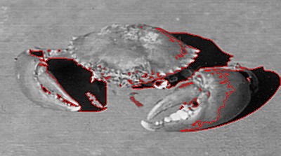
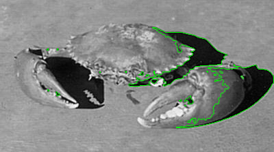
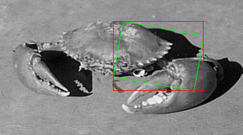
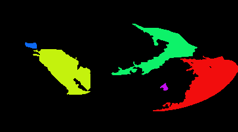

# image-debug-utils

[](https://deepwiki.com/bioinformatist/image-debug-utils)

Some niche but useful utilities for [`imageproc`](https://github.com/image-rs/imageproc).

## Usage

## Examples

### Visual Comparison

Demonstration of `remove_hypotenuse_in_place` filtering out high-aspect-ratio artifacts (thin lines) from a synthetic shape.

| Before Processing | After `remove_hypotenuse_in_place` |
| :---: | :---: |
|  |  |
| *Original contours (Red) showing noisy thin lines* | *Processed contours (Green) with noise removed* |

### Feature Gallery

| Intelligent Bounding Boxes | Connected Components Labeling |
| :---: | :---: |
|  |  |
| *Converting Rotated Rects (Green) to AABB (Red)* | *Visualizing Top-5 connected regions with distinct colors* |

### Interactive Demo (WASM)

Try the interactive visualizer to experiment with parameters in real-time.

**Run Locally:**
```bash
cd examples/visualizer
trunk serve
```

**Features:**
- **Mode Selection**: Switch between 5 different demonstration modes.
- **Filter Contours**: Real-time `remove_hypotenuse_in_place` handling (Aspect Ratio).
- **Sort Contours**: Visualize `sort_by_perimeters_owned` and `sort_by_direct_children_count_owned` via heatmaps.
- **Bounding Boxes**: Compare Rotated Rects (Blue) vs Axis-Aligned Bounding Boxes (Red) using `to_axis_aligned_bounding_box`.
- **Connected Components**: Visualize `draw_principal_connected_components` with adjustable Top-N ranking.
- **Random Images**: Instantly fetch fresh content from `picsum.photos` to test robustness.
